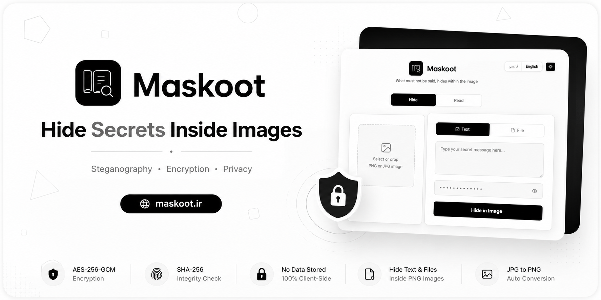
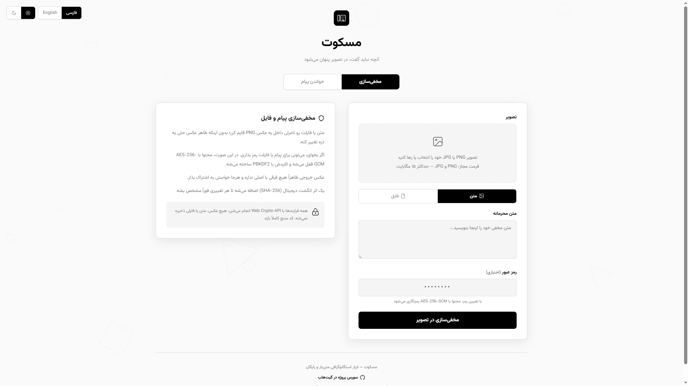

# مسکوت | Maskoot

  

  <strong>پنهان‌سازی متن و فایل در تصاویر بدون تغییر ظاهری تصویر</strong>

  🌍 <a href="./README.md">View English Version</a>
     
  🚀 نسخه آنلاین: https://maskoot.ir

---

## معرفی

مسکوت یک ابزار متن‌باز و رایگان برای استگانوگرافی (Steganography) است که امکان مخفی‌سازی متن و فایل در تصاویر PNG را فراهم می‌کند.

تمام عملیات رمزنگاری و استخراج محتوا در مرورگر انجام می‌شود و هیچ‌گونه تصویر، فایل، رمز عبور یا پیامی روی سرور ذخیره نمی‌شود.

  

---

## قابلیت‌ها

- مخفی‌سازی متن داخل تصویر
- مخفی‌سازی هر نوع فایل داخل تصویر
- رمزنگاری اختیاری با AES-256-GCM
- تولید کلید با PBKDF2
- بررسی صحت داده با SHA-256
- پشتیبانی از تصاویر PNG و JPG
- تبدیل خودکار JPG به PNG
- استخراج متن و فایل از تصویر
- پردازش کامل سمت کاربر (Client-Side)
- رابط کاربری فارسی و انگلیسی
- طراحی واکنش‌گرا (Responsive)
- متن‌باز و رایگان

---

## امنیت

مسکوت از استانداردهای مدرن امنیتی استفاده می‌کند:

- رمزنگاری AES-256-GCM
- الگوریتم PBKDF2 با 100,000 تکرار
- اثر انگشت SHA-256 برای تشخیص تغییرات
- Web Crypto API
- ارتباط امن HTTPS

تمام عملیات حساس در مرورگر کاربر انجام می‌شود.

---

## نحوه استفاده

۱. تصویر مورد نظر را انتخاب کنید.

۲. حالت متن یا فایل را مشخص کنید.

۳. در صورت نیاز رمز عبور وارد کنید.

۴. تصویر جدید را تولید و دانلود کنید.

۵. تصویر را نگهداری یا برای دیگران ارسال کنید.

۶. در آینده با بارگذاری همان تصویر، محتوای مخفی را استخراج کنید.

---

## تکنولوژی‌های استفاده شده

- JavaScript (ES Modules)
- Cloudflare Workers
- Web Crypto API
- HTML5
- CSS3
- OffscreenCanvas
- PNG Chunk Manipulation

---

## نسخه آنلاین

https://maskoot.ir

---

## تصاویر

---

## مجوز

MIT License

---

## توسعه‌دهنده

**رادمهر**

گیت‌هاب:
https://github.com/radmehr2025

اگر این پروژه برای شما مفید بود، با دادن ⭐ از آن حمایت کنید.
