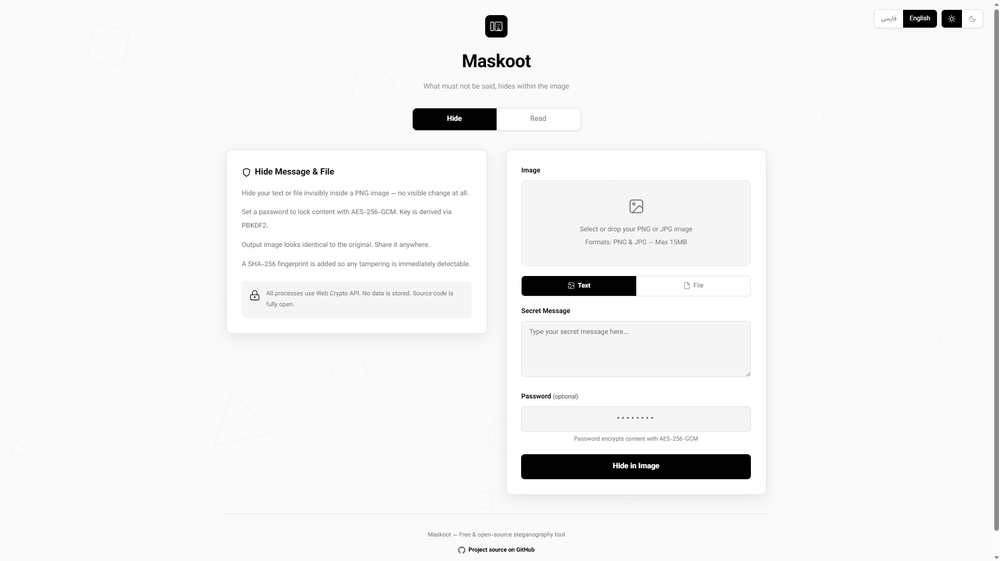

# Maskoot

  

  <strong>Hide text and files inside images without changing their appearance.</strong>

  🌍 <a href="./README.fa.md">مشاهده نسخه فارسی</a>
     
  🚀 Live Demo: https://maskoot.ir

---

## About

Maskoot is a free and open-source steganography tool that allows you to hide text messages and files inside PNG images.

The hidden content can optionally be encrypted using AES-256-GCM and is processed entirely in the browser using the Web Crypto API.

No files, passwords, or messages are stored on the server.

  

---

## Features

- Hide text inside PNG images
- Hide any file inside PNG images
- Optional AES-256-GCM encryption
- PBKDF2 key derivation
- SHA-256 integrity verification
- PNG and JPG input support
- Automatic JPG → PNG conversion
- Extract hidden content from images
- Fully client-side cryptography
- Persian and English interface
- Responsive UI
- Open source

---

## Security

Maskoot uses modern cryptographic standards:

- AES-256-GCM encryption
- PBKDF2 with 100,000 iterations
- SHA-256 integrity fingerprint
- Web Crypto API
- HTTPS communication

All sensitive operations are performed inside the browser.

---

## How It Works

1. Select an image.
2. Choose Text or File mode.
3. Optionally enter a password.
4. Generate the encoded image.
5. Share or store the generated PNG.
6. Upload the image later to recover the hidden content.

---

## Technology Stack

- JavaScript (ES Modules)
- Cloudflare Workers
- Web Crypto API
- HTML5
- CSS3
- OffscreenCanvas
- PNG Chunk Manipulation

---

## Live Demo

https://maskoot.ir

---

## Screenshots

---

## License

MIT License

---

## Author

**Radmehr**

GitHub:
https://github.com/radmehr2025

If you like this project, please consider giving it a ⭐.
